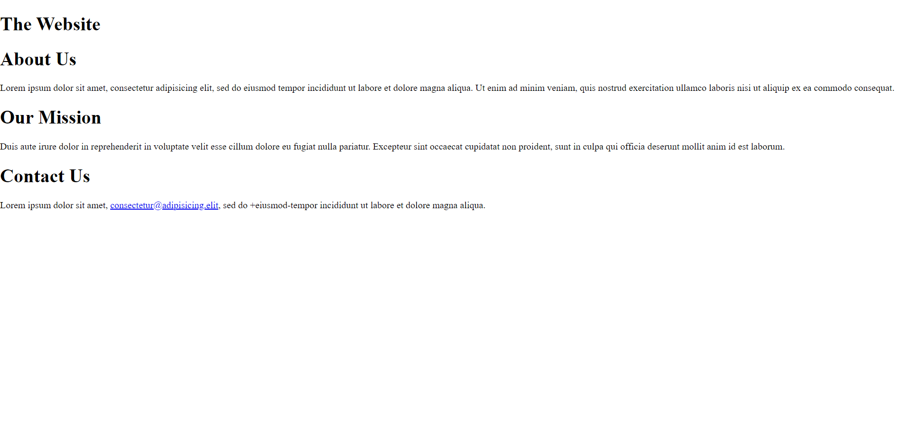
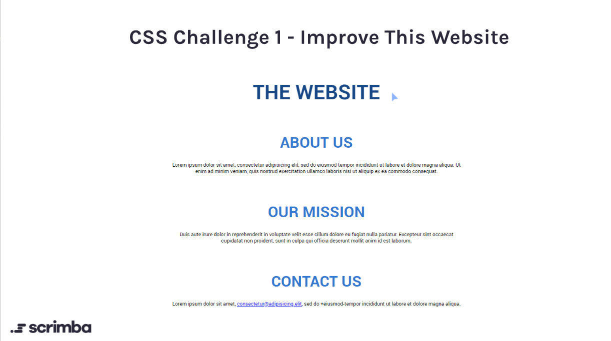
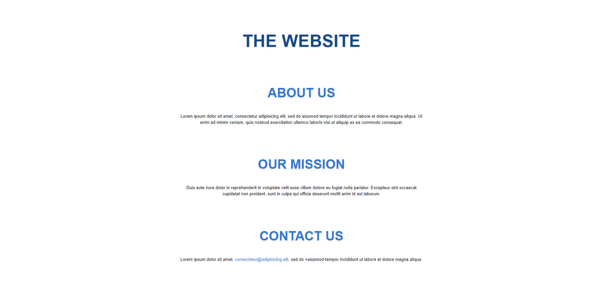

# CSS Challenge Day 1 - Improve This Website

You can see the <a href="https://abuna1985.github.io/scrimba-7-day-css-challenge/day-01/" target="_blank">completed challenge for day 1 here.</a>

## Requirements

The main goal is to style and improve the HTML given to you here:

  

And add the following changes:

- You have to center all the text on the page
- Set the font to `Roboto`
- Capitalize all the titles
- Give the main title a font size of 4em and the section titles a size of `3em`
- Give all the sections an overall margin of `10%` of the height of the page.
- The section titles must have a color of `#3278cf`.
- The main title must have a color of `#174885`.

The result will look like this:

  

## Description

After reading <a href="https://www.brucelawson.co.uk/" target="_blank">Bruce Lawson's</a> article on <a href="https://www.brucelawson.co.uk/2019/html5-article-section-hgroup/" target="_blank">the difference between `<article>` and `<section>`</a>, <a href="https://www.brucelawson.co.uk/2018/the-practical-value-of-semantic-html/" target="_blank">the practical value of HTML</a>, and <a href="https://www.w3schools.com/html/html_accessibility.asp" target="_blank">W3schools article on HTML accessibility</a>, I decided to keep it simple. I added semantic HTML and convert `
` with the class of `section` to `<article>` elements. I added an underline effect for the one link on hover and added a `title` attribute. Finally I ran my HTML file through the <a href="https://validator.w3.org/" target="_blank">W3C validator</a> and received no errors.

I grouped my css in 4 groups:

1. base(global)
2. shared(multiple selectors)
3. individual(one selector)
4. responsiveness (media queries)

This is my end result:

  

The only change I made was set a media query for screens with less than 800px of width to have padding on the sides (so text is visible) and to make the `font-size` slightly smaller.

You can see the <a href="https://abuna1985.github.io/scrimba-7-day-css-challenge/day-01/" target="_blank">completed challenge for day 1 here.</a>
